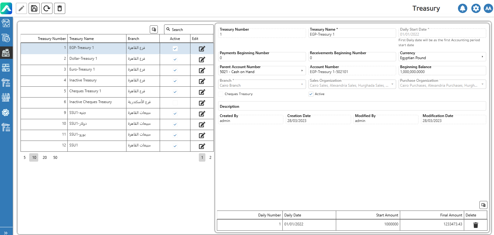
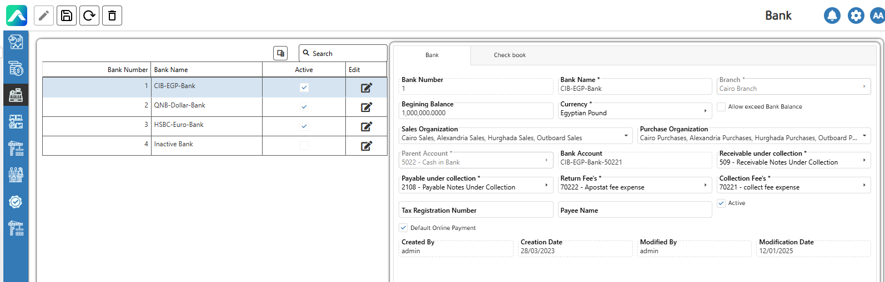

# Cash Control Definitions&#x20;

**Cash control** is the process of overseeing and managing all cash-related activities—such as treasury functions, cheque handling, and bank transfers—to ensure secure, accurate, and authorized receiving and payment transactions. It involves setting up proper procedures for collecting incoming funds and processing outgoing payments, helping maintain liquidity, prevent fraud, and ensure that all financial movements are properly recorded and controlled.

·         Treasury screen is a section or interface within an accounting or financial management system used to manage a company’s cash and liquidity activities.

<figure><figcaption>
Treasury Screen
</figcaption></figure>

A **bank screen** is a section within an accounting or financial system that displays and manages information related to a company’s bank accounts.

<figure><figcaption>
Bank Screen
</figcaption></figure>
