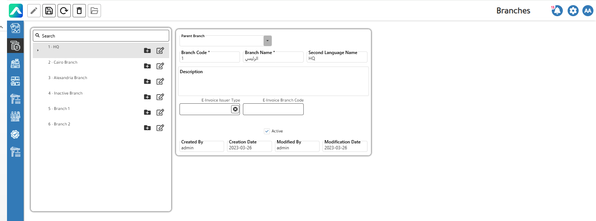
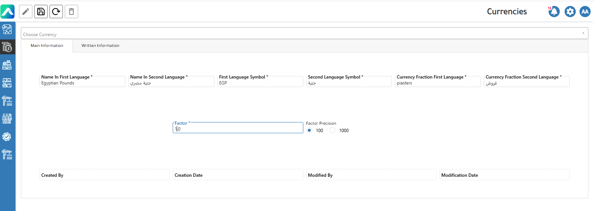
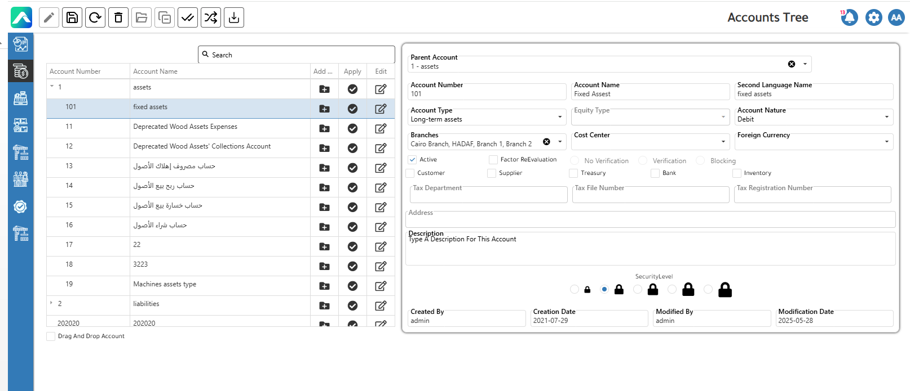
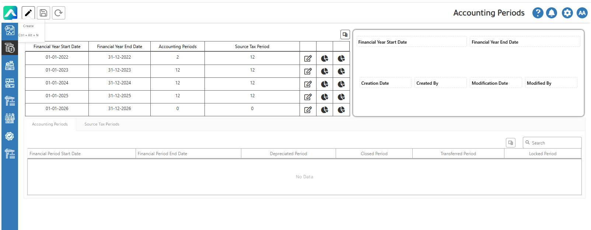
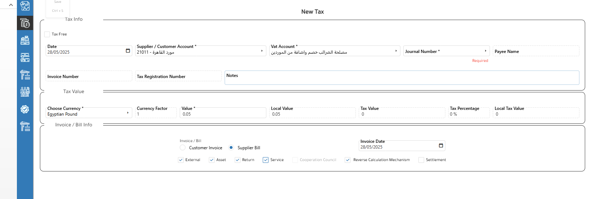

# General Ledger Definitions

The GL setup is foundational to the ERP system because it controls how financial transactions are recorded, reported, and audited. Here's a walkthrough of the main definition screens in the **GL module**:

·         Define different business locations or operational entities, by its Branch Code and Name, E-invoice type and Code.

<figure><figcaption>
Branches Screen
</figcaption></figure>

·         Set up base and foreign currencies with exchange rates for multi-currency transactions.

<figure><figcaption>
Currencies
</figcaption></figure>

·         Track expenses and revenues by department, project, or branch to analyze profitability.

<figure><figcaption>
Cost Center
</figcaption></figure>

·         Defines the structure of all accounts used in the ERP for recording transactions.

<figure><figcaption>
Chart of Accounts
</figcaption></figure>

·         Define and control financial periods for transactions.

<figure><figcaption>
Accounting periods
</figcaption></figure>

·         Taxes Actions contain more one definition.

o   Customer source tax

<figure><figcaption>
Customer Source Tax
</figcaption></figure>

o   Supplier source tax

<figure><figcaption>
Supplier Source Tax
</figcaption></figure>

o   Value added tax

<figure><figcaption>
Value Added Tax
</figcaption></figure>
