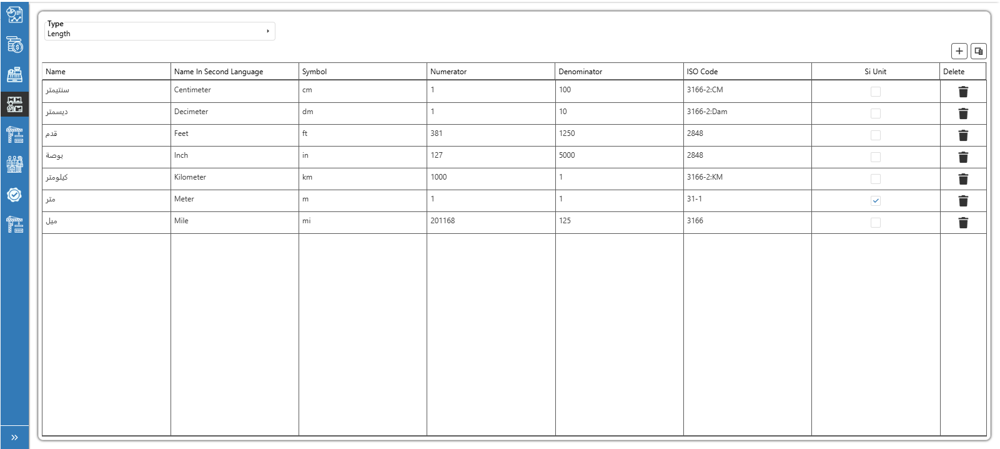
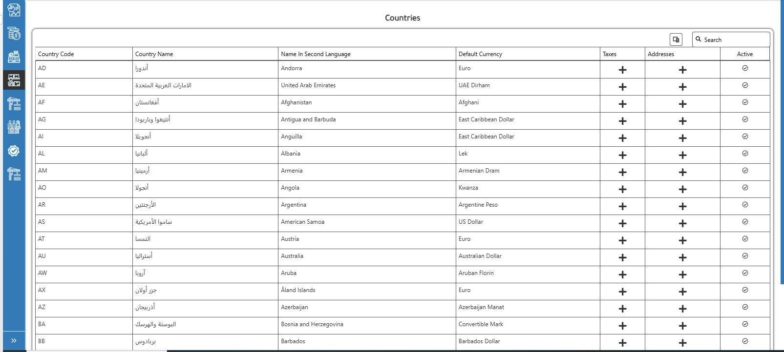

# Inventory Basic Definitions

Inventory basic definitions are the foundation of the entire ERP system. These definitions ensure that all modules—such as procurement, inventory, sales, and finance—use consistent, accurate, and standardized data. Without properly setting up items like units, locations, materials, and payment terms, the system cannot perform transactions correctly or generate reliable reports. In short, the basic definitions enable smooth workflow, accurate costing, integrated reporting, and operational control across all business processes.

·         (UOM): Defines how materials are quantified across the system (e.g., KG, TON, M3).

<figure><figcaption>
Units of Measurement (UOM)
</figcaption></figure>

·         Countries: Sets up the list of countries as it can be used across vendors, customers, warehouses, and branches.

<figure><figcaption>
Countries screen
</figcaption></figure>

·         Inventory Management and Location: Defines physical or logical storage areas where inventory is tracked (e.g., warehouses, yards, silos).

<figure><figcaption>
Inventory Management
</figcaption></figure>

<figure><figcaption>
Inventory Location
</figcaption></figure>

·         Payment Terms: Specifies how and when payments should be made to vendors or received from customers.

<figure><figcaption>
Payment Terms Screen
</figcaption></figure>

·         Material Categories: Groups materials based on their function or type for easier classification and reporting.

<figure><figcaption>
Material Categories
</figcaption></figure>

·         Material Master: Central definition of all materials used in procurement, production, and sales.

<figure><figcaption>
Material Master
</figcaption></figure>
