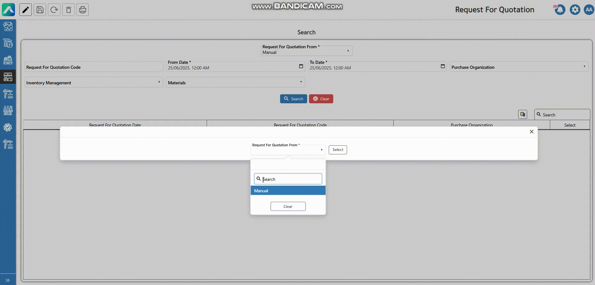

# Procurement and Inventory



<figure><figcaption>
Purchase and Inventory Cycle
</figcaption></figure>

The procurement process begins when a company identifies the need to purchase materials, such as cement, sand, or chemicals used in ready-mix production, the next step is to issue a [Purchase Requisition](https://app.gitbook.com/o/FpgOHTJFdWeXXMPy7SYX/s/wMgspsmpDh7pjT2cYDwA/). This is essentially an internal document raised by a department requesting specific items. This ensures that all purchases are validated and aligned with budget and operational needs.

<figure><figcaption>
Purchase Requisition
</figcaption></figure>

Before committing to a supplier, the company typically seeks out the most competitive offer. The procurement department sends requests for quotations (RFQs) to multiple suppliers. These suppliers respond with pricing, delivery timelines, and terms. AccFlex allows you to enter each of these quotations into the system this is managed through  [**Supplier Quotation**](https://app.gitbook.com/o/FpgOHTJFdWeXXMPy7SYX/s/wMgspsmpDh7pjT2cYDwA/) stage, and then they can be compared and evaluated based on price, availability, and contractual conditions. This process helps ensure that procurement decisions are well-informed and economically sound.

<figure><figcaption>
RFQ
</figcaption></figure>

<figure><figcaption>
Supplier Quotation
</figcaption></figure>

&#x20;&#x20;

<figure><figcaption>
Price Comparison
</figcaption></figure>

Once a supplier selected, the following next is the approval of the requisition, a [Purchase Order](https://app.gitbook.com/o/FpgOHTJFdWeXXMPy7SYX/s/wMgspsmpDh7pjT2cYDwA/) (PO) is generated. The PO acts as a formal agreement between the company and the chosen supplier. It includes exact quantities, unit prices, delivery schedules, payment terms, and other conditions that were either agreed upon in the quotation stage or adjusted based on internal needs. In AccFlex ERP, the purchase order links directly to the supplier and inventory system, so it can later be matched with the actual goods received and the supplier's invoice.

<figure><figcaption>
Purchase Order
</figcaption></figure>

Once the goods have been received and recorded in the system through the GR/IR, the supplier sends an invoice for the delivered materials.

<figure><figcaption>
Invoice verification
</figcaption></figure>

Then the payment can be done wheather via bank or cash.

<figure><figcaption>
Payment
</figcaption></figure>

**Journal Entry:**

<table data-header-hidden><thead><tr><th valign="top"></th><th valign="top"></th><th valign="top"></th></tr></thead><tbody><tr><td valign="top">Description</td><td valign="top">Debit</td><td valign="top">Credit</td></tr><tr><td valign="top">Stock</td><td valign="top">×××</td><td valign="top"> </td></tr><tr><td valign="top">                              GR/IR</td><td valign="top"> </td><td valign="top">×××</td></tr></tbody></table>

&#x20;

<table data-header-hidden><thead><tr><th valign="top"></th><th valign="top"></th><th valign="top"></th></tr></thead><tbody><tr><td valign="top">Description</td><td valign="top">          Debit     </td><td valign="top">Credit</td></tr><tr><td valign="top">GR/IR</td><td valign="top">×××</td><td valign="top"> </td></tr><tr><td valign="top">VAT</td><td valign="top">××</td><td valign="top"> </td></tr><tr><td valign="top">                                          WHT</td><td valign="top"> </td><td valign="top">×</td></tr><tr><td valign="top">Supplier</td><td valign="top"> </td><td valign="top">×××</td></tr></tbody></table>

&#x20;

<table data-header-hidden><thead><tr><th valign="top"></th><th valign="top"></th><th valign="top"></th></tr></thead><tbody><tr><td valign="top">Description</td><td valign="top">Debit</td><td valign="top">Credit</td></tr><tr><td valign="top">Supplier</td><td valign="top">×××××</td><td valign="top"> </td></tr><tr><td valign="top">Cash/ Bank</td><td valign="top"> </td><td valign="top">××××</td></tr></tbody></table>

&#x20;

&#x20;

&#x20;

&#x20;



This is a critical part of the workflow because managing the raw materials (like sand, gravel, cement, water, and additives) and their movement into and out of inventory directly affects cost control, stock accuracy, and batch quality.

### 1 Good Receipt

In AccFlex ERP, this event is captured using a [**Goods Receipt** ](../../../applications/logistics-group/inventory/transaction/good-receipt.md). This document records what materials were physically received, their quantities, the warehouse, and links them to the related [**purchase order**](../../../applications/logistics-group/procurement/transaction/purchase-order.md)**.** Upon receipt, the inventory module is automatically updated to reflect the new stock levels.

<figure><figcaption>
Good Receipt
</figcaption></figure>

### 2 Good Issue

The [**Good Issue**](../../../applications/logistics-group/inventory/transaction/goods-issue.md) **screen** automatically records inventory movement when the [**Ready Mix Delivery**](ready-mix.md) **screen** status changes to **"On Way."** This means once the delivery truck leaves the plant, the system deducts the issued raw materials from the warehouse and logs it as a goods issue with type delivery plan, ensuring real-time and accurate stock tracking.

<figure><figcaption>
Goods Issue
</figcaption></figure>

**Journal Entry:**

a.      Goods receipt

<table data-header-hidden><thead><tr><th valign="top"></th><th valign="top"></th><th valign="top"></th></tr></thead><tbody><tr><td valign="top">Description</td><td valign="top">Debit</td><td valign="top">Credit</td></tr><tr><td valign="top">Stock</td><td valign="top">××</td><td valign="top"> </td></tr><tr><td valign="top">         GR/IR</td><td valign="top"> </td><td valign="top">××</td></tr></tbody></table>

&#x20;

b.     Goods Issue

<table data-header-hidden><thead><tr><th valign="top"></th><th valign="top"></th><th valign="top"></th></tr></thead><tbody><tr><td valign="top">Description</td><td valign="top">Debit</td><td valign="top">Credit</td></tr><tr><td valign="top">Production under manufacture</td><td valign="top">××</td><td valign="top"> </td></tr><tr><td valign="top">      Stock</td><td valign="top"> </td><td valign="top">××</td></tr></tbody></table>


